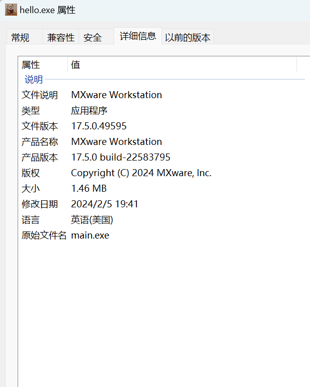

# Go-metainfo

## Windows
```bash
windres.exe -i .\main.rc -o main.syso
go build -ldflags "-s -w" -trimpath -o .\hello.exe
```

## Linux
```bash
x86_64-w64-mingw32-windres -F pe-x86-64 main.rc -O coff -o main.syso

CGO_ENABLED=0 GOOS=windows GOARCH=amd64 go build -ldflags "-s -w" -trimpath -o .\hello.exe
```

